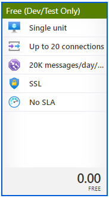

# To run locally

1.  You'll need the following:

    - An Azure account.

      - Set up an Azure SignalR Service as a Dev/Test account to ensure it remains free.

        

    - .NET Core 3.1 SDK (Azure Functions does not yet support .NET 5 at the time this was written.)
    - Azure Functions SDK 3.0 or newer

      You can install this via npm:

          npm install -g azure-functions-core-tools@3

    - Azure Storage Emulator

2.  Set up user secrets:

    You can get your connection string from the Azure Portal for the Azure SignalR Service you created within the "Keys" page in the "Settings" section.

        dotnet user-secrets set AzureSignalRConnectionString "your-azure-signalr-connection-string"

3.  Start your Azure Storage Emulator.
4.  Start the functions.

        func start
